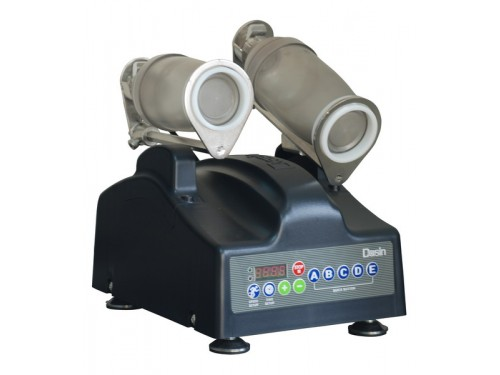
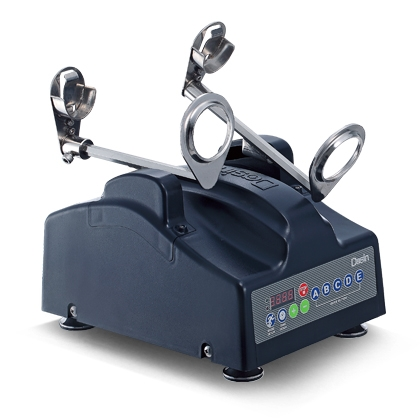
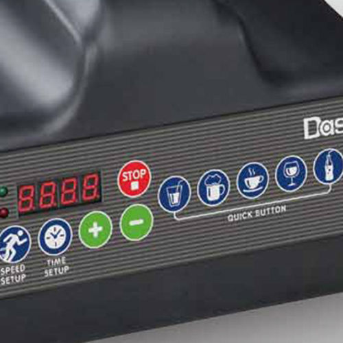

### UX Journal Entry 1: Sydney Serrano 3/7/2021
##### My user eXperience with a milk tea shaker machine 

In the middle of February, I picked up a job as a milk tea barista at a shop called Tpumps. They gave me the rundown of how to make the drinks and what how to operate 
some of the machinery that was there. On the first day, I was taught how to "ice" drinks, which is a term used to describe the process of shaking the hot teas mixed 
with the flavors and sugars within a shaker filled with ice to cool it down. Now some days there are long lines with people who order multiple drinks, making it difficult 
to ice more than two drinks at a time. Eventually, I was introduced to the milk tea shaker machine that the staff uses when the line gets hectic. Below are a couple of images 
of the machine:  
  

  
  
The **utility** of this bad boy, or in other words its usefulness, allows a barista to place two shaker cups in and presses a button to have it start shaking the cups for a 
certain number of seconds, depending on the button that was pressed. It allows a barista to focus on other tasks, such as shaking one or two other shaker cups or pouring other 
drinks that are past the shaking process and sealing the cups that they are poured into. The **efficiency** of the machine, or how quickly the machine produces results of high 
quality, supplies the barista who is icing with up to two well shaken drinks within five to ten seconds, depending on the button pressed. The **learnability** of the machine, or 
how easy it is for someone to pick up how to operate the machine, was probably one of its weaknesses overall. Here is a picture of the buttons that are on the front of the 
machine:  
  
  
  
Instead of the images that are present on the blue buttons above the "Quick Button" text, the machine within my workplace had the letters A through E from left to right. 
Each button resulted in the machine shaking in five more seconds than the button on the left. This meant that button A would have shaken the tea for five seconds, button 
B would shake the tea for ten seconds, C for fifteen seconds, and so on. If I had not been taught by my coworkers how to use the machine, I probably would have struggled 
to figure out how to operate it. However, with the knowledge given to me by my trainers, this machine has definitely been a lifesaver during the frantic shifts that I have 
worked.  
