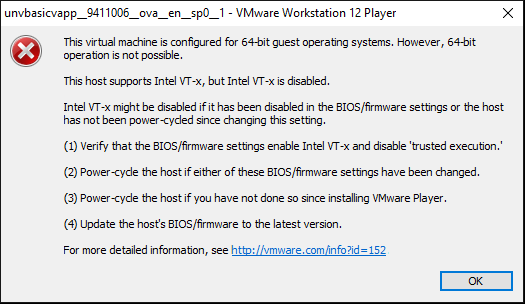
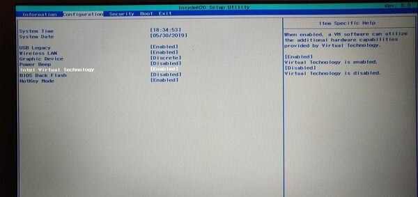

### UX Journal Entry 2: Sydney Serrano 5/2/2021 
##### My user eXperience tampering with the BIOS in my laptop for the first time

Within the spring semester of 2020, I walked into my first Operating Systems lecture and sat down ready to see what I needed to pass the class. Within the last half of the class, 
my instructor told me that I needed to install a virtual machine in order to run a linux-based development environment so that all of the students can test their project code 
and produce results and bugs that were consistent throughout the class. When I first heard this, I was slightly intimidated as I never did that sort of thing before.  
  
When I got home I downloaded VMWare Workstation player 15 as well as the latest version of Ubuntu. It was simple enough to configure options such as the ram and the storage that 
the host system can allocate. All was well until I tried to run the virtual machine that I had just created for the first time. I was hit with the error screen shown in the figure 
below:  
  
  
  
At first I was scared that I had seriously messed up some configuration within my computer during the installation process. However, after a few deep breaths and some 
internet probing, I was able to find a solution to my problem. Apparently, the Intel Virtual Technology option within my actual computer hardware settings was disabled by default 
by the manufacturers of my laptop. After some researching, I found out that I had to restart my laptop in safe mode in order to toggle it on. This was the first time that I had
ever launched a computer into safe mode, so it was an intriguing yet scary experience. I ended up navigating to a screen similar to this one:  
  
  
  
Afterwards, I restarted my laptop and tried to start up my virtual machine yet again. This time, I had succeeded in booting it up and installing the Ubuntu operating system. The 
**satisfaction**, or how good the technology makes a user feel when they achieve their goal, from seeing the virtual machine come to life after tinkering with the deepest parts 
of my laptop hardware was immeasurable as the BIOS screen was something I had never seen before that day. In terms of **efficiency**, or how well the technology at helping users 
complete tasks quickly, the BIOS screen was slightly **efficient**, as it was organized into categories of tabs that were sectioned off within tabs at the top of the screen, but 
each tab had a long list of items to choose from as the categories were vague. I had to parse through the list for a few more minutes before I was able to find the Intel Virtual 
Technology Option. In terms of **error tolerance**, or how well the technology catches a user making an error and guiding them back on track, the BIOS screen is also decently 
**error tolerant**, as it prompts a user an "are you sure" screen whenever they wish to toggle any options, as well as when the user wants to save and exit the BIOS screen. I have 
not used the BIOS screen since that first time I installed a virtual machine, but thanks to it, I know a little more about what my hardware is capable of doing. Maybe whenever I 
build a PC in the future, I will interact with the BIOS screen again and potentially unlock the full power of the hardware that I am using. 
